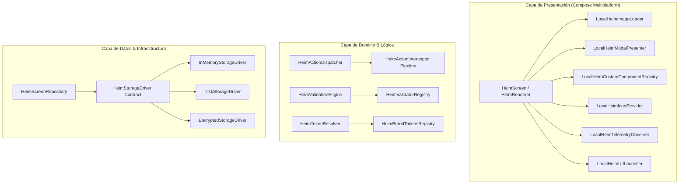

# HeimUI: Server-Driven UI Framework for Kotlin Multiplatform
## Master Technical Architecture Specification v1.7.0 (Clean Architecture & Enterprise Production Ready)

> **Tagline Oficial:** *The extensible Server-Driven UI framework for Kotlin Multiplatform & Compose.*

---

## 1. Visión del Proyecto y Filosofía de Diseño

**HeimUI** proporciona una solución integral de **Server-Driven UI (SDUI)** nativa para Android e iOS utilizando **Kotlin Multiplatform (KMP)** y **Compose Multiplatform**, respaldada por un motor de orquestación e hidratación en **Ktor** y una consola de administración visual construida en **Next.js**.

### Principios Fundamentales
* **Zero-Bridge Native Performance:** Renderizado directo mediante Skiko (iOS) y Jetpack Compose (Android) a 60/120 FPS sin intermediación de WebViews ni intérpretes JS.
* **Strict Clean Architecture:** Desacoplamiento absoluto entre la lógica de dominio puro (Kotlin Multiplatform), la capa de datos/red y la capa de presentación (Compose).
* **100% Type-Safe & Zero Reflection:** Serialización en tiempo de compilación con `kotlinx.serialization` para total inmunidad contra ofuscación agresiva (R8 / ProGuard / DexGuard).
* **Contrato Universal Tipado (Kotlin -> JSON Schema -> TypeScript):** Generación automática de tipos para sincronizar Next.js con KMP.
* **Accesibilidad Nativa Universal (A11y):** Soporte semántico declarativo para lectores de pantalla (TalkBack en Android y VoiceOver en iOS).
* **Persistencia Reactiva de Formularios:** Recuperación de estado en disco si la app se suspende durante un flujo multi-paso.
* **Motor Híbrido de Hidratación (Templates + Data Sources):** Soporte tanto para pantallas estáticas No-Code como para pantallas dinámicas conectadas a microservicios/DB mediante iteradores y variables reactivas.
* **Resiliencia & Screen State Machine:** Gestión nativa de estados de carga, Skeletons declarativos, Empty States, errores de red con Retry y Pull-to-Refresh.
* **Seguridad Criptográfica Fintech:** Verificación de firma de payloads (Ed25519 / HMAC) para evitar inyección maliciosa por MITM.
* **Offline-First & Observabilidad:** Carga instantánea con Stale-While-Revalidate, telemetría de rendimiento (Time-To-Render) y reporte de errores a Sentry/Datadog.

---

## 2. Clean Architecture: Separación de Capas y Modularización

### 2.1. Arquitectura de Capas en `heimui-core` (SDK Móvil KMP)

```
io.heimui.core/
│
├── domain/                               # Capa 1: Kotlin Puro (Zero Compose, Zero Android/iOS)
│   ├── model/                            # Modelos de contrato y entidades (@Serializable)
│   │   ├── HeimComponent.kt              # Árbol de componentes polimórfico
│   │   ├── HeimAction.kt                 # Acciones, deep links y eventos
│   │   ├── HeimScreenResponse.kt         # Payload raíz y metadatos
│   │   └── accessibility/HeimA11y.kt     # Definición de roles y descriptores A11y
│   ├── evaluator/                        # Reglas de negocio puras
│   │   ├── HeimConditionEvaluator.kt     # Evaluación de expresiones visibleIf
│   │   └── HeimValidationEngine.kt       # Validador de regex, required y rangos
│   └── repository/                       # Interfaces abstractas de datos
│       └── HeimScreenRepository.kt       # Contrato getScreen(id), cacheScreen(...)
│
├── data/                                 # Capa 2: Infraestructura, Red, Storage y Cripto
│   ├── datasource/
│   │   ├── remote/HeimRemoteDataSource.kt# Cliente Ktor con ETags e interceptores
│   │   └── local/HeimCacheDataSource.kt  # Almacenamiento local (KV / SQLite / Disk)
│   ├── repository/
│   │   └── HeimScreenRepositoryImpl.kt   # Orquestador Stale-While-Revalidate
│   └── security/
│       └── Ed25519SignatureVerifier.kt   # Verificación criptográfica de bytes
│
└── presentation/                         # Capa 3: UI, Estado y Renderizado en Compose
    ├── HeimRenderer.kt                   # Composables polimórficos de maquetación
    ├── component/                        # Primitivas individuales (Image, Button, Container)
    ├── state/HeimStateManager.kt         # Estado reactivo y bindings {{state.key}}
    ├── designsystem/
    │   ├── HeimTokens.kt                 # Tokens de color, tipografía y espaciado
    │   └── HeimTokenResolver.kt          # Resuelve tokens semánticos vs colores raw
    └── telemetry/
        └── HeimTelemetryObserver.kt      # Integración con Sentry / Amplitude / Datadog
```

---

### 2.2. Arquitectura de Capas en `heimui-server` (Backend Ktor)

```
io.heimui.server/
│
├── domain/                               # Capa 1: Lógica de negocio y modelos de hidratación
│   ├── model/                            # Modelos de pantalla, borradores y experimentos
│   ├── hydration/HeimHydrationEngine.kt  # Motor AST de fusión de plantillas con variables
│   ├── experiment/ExperimentEngine.kt    # Consistent Hashing para A/B Testing
│   └── datasource/HeimDataSource.kt      # Interface para conectar APIs o microservicios
│
├── data/                                 # Capa 2: Persistencia y Criptografía
│   ├── repository/ScreenRepositoryImpl.kt# Base de datos (Exposed / PostgreSQL / SQLite)
│   └── security/PayloadSigner.kt         # Firma de respuestas con clave privada Ed25519
│
└── presentation/ (Transport Layer)       # Capa 3: Exposición de APIs REST y WebSockets
    ├── routing/ScreenRoutes.kt           # Endpoints públicos para el SDK móvil
    ├── routing/AdminRoutes.kt            # Endpoints de draft/publish para HeimUI Studio
    └── generator/JsonSchemaExporter.kt   # Generador de heimui-schema.json / TypeScript
```

---

## 3. Optimizaciones de Runtime de Bajo Nivel (Compose & Skiko)

1. **Gestión de WindowInsets (Edge-to-Edge & Safe Areas):**
   El componente raíz `HeimScreenResponse.root` incluye la propiedad configurable `applySafeInsets: Boolean` (por defecto `true`). Al activarse, aplica automáticamente `Modifier.windowInsetsPadding(WindowInsets.safeDrawing)` para respetar la Dynamic Island en iOS y barras de navegación en Android 15+.
2. **Deserialización Off-Main Thread (`Dispatchers.Default`):**
   Toda la operación de parsing JSON, validación de firma Ed25519 y mapeo de AST se ejecuta estrictamente en un contexto de corrutinas en background (`withContext(Dispatchers.Default)`), evitando cualquier bloqueo del hilo principal (*Main Thread UI*).
3. **Estabilidad del Compilador de Compose (`@Immutable`):**
   Los modelos del paquete `io.heimui.core.model.**` se configuran como estables mediante archivo de estabilidad del compilador (`compose_compiler_config.conf`), garantizando que las recomposiciones sean estrictamente quirúrgicas cuando muta el estado local.
4. **Captura de Retorno de Flujos Nativos (`onNativeResult`):**
   `HeimStateManager` implementa el callback `onNativeResult(key: String, value: Any)` para recibir resultados de biometría, cámara o pasarelas nativas sin forzar una recarga completa de la pantalla SDUI.

---

## 4. Ecosistema de la Suite y Arquitectura Global

```
┌────────────────────────────────────────────────────────────────────────┐
│                     HEIMUI STUDIO (Dashboard Web)                      │
│  • Stack: Next.js 14+ (App Router), TypeScript (Auto-generated types)  │
│  • Visual Tree Editor (Drag & Drop con @dnd-kit)                       │
│  • Inspector de A11y, Validaciones, Skeletons, Error & Empty States    │
│  • Live Simulator interactivo y gestión visual de A/B Testing          │
└───────────────────────────────────┬────────────────────────────────────┘
                                    │  REST / WebSockets (HeimUI Protocol)
┌───────────────────────────────────▼────────────────────────────────────┐
│                    HEIMUI SERVER (BFF & Hydration Engine)              │
│  • Stack: Ktor Core + Exposed / PostgreSQL                             │
│  • Schema Generator: Exporta JSON Schema & TypeScript Interfaces       │
│  • Data Source Registry: Conexión con DBs y Microservicios internos    │
│  • Template Hydration Engine: Resuelve {{mustache}} e iteradores       │
│  • Motor de asignación de A/B Testing por Consistent Hashing           │
│  • Firma Criptográfica de Payloads (Ed25519) + Sincronización por ETag │
└───────────────────────────────────┬────────────────────────────────────┘
                                    │  JSON 100% Resuelto + Firma + ETag
┌───────────────────────────────────▼────────────────────────────────────┐
│                      HEIMUI CORE (KMP Mobile SDK)                      │
│  • Package: io.heimui.core  |  Artefacto: io.heimui:core               │
│  • 100% Compose Multiplatform (Android Jetpack Compose + iOS Skiko)    │
│  • Clean Architecture (Domain / Data / Presentation desacoplados)      │
│  • State Machine: Loading (Shimmer), Error (Retry), Content, Empty     │
│  • Local Form Persistence & Crash Recovery (Key-Value Engine)          │
│  • Compose Semantics Engine (TalkBack / VoiceOver)                     │
│  • Visual Snapshot Testing Engine (Roborazzi / Paparazzi)              │
│  • Zero-Reflection Parser + Caché Stale-While-Revalidate               │
└────────────────────────────────────────────────────────────────────────┘
```

---

## 5. Máquina de Estados de Pantalla (Screen State Architecture)

```
                  ┌──────────────────────┐
                  │    INITIAL FETCH     │
                  └──────────┬───────────┘
                             │
            ┌────────────────┴────────────────┐
     ¿Hay caché local?               ¿No hay caché?
            │                                 │
     ┌──────▼──────┐                   ┌──────▼──────┐
     │   CONTENT   │                   │   LOADING   │
     │  (Stale UI) │                   │  (Skeleton) │
     └──────┬──────┘                   └──────┬──────┘
            │                                 │
            └───────────────┬─────────────────┘
                            │ (Background HTTP Request)
            ┌───────────────┴───────────────┐
            │                               │
         SUCCESS                          ERROR (500 / Timeout / Offline)
            │                               │
    ┌───────▼────────┐             ┌────────▼────────┐
    │ ¿Items vacíos? │             │ ¿Hay Stale UI?  │
    └───┬────────┬───┘             └───┬────────┬────┘
    NO  │        │ SÍ              SÍ  │        │ NO
  ┌─────▼───┐ ┌──▼──────┐      ┌───────▼──┐  ┌──▼──────┐
  │ CONTENT │ │  EMPTY  │      │ Mantener │  │  ERROR  │
  │ (Fresh) │ │  STATE  │      │ Mostrar  │  │ SCREEN  │
  └─────────┘ └─────────┘      │ SnackBar │  │ + Retry │
                               └──────────┘  └─────────┘
```

---

## 6. Motor de Hidratación y Data Sources (Ktor Engine)

### 6.1. Registro de Orígenes de Datos en el Backend

```kotlin
package io.heimui.server.domain.datasource

import kotlinx.serialization.json.JsonElement

fun interface HeimDataSource {
    suspend fun fetchData(context: HeimRequestContext): JsonElement
}

data class HeimRequestContext(
    val userId: String,
    val appVersion: String,
    val platform: String,
    val queryParams: Map<String, String> = emptyMap()
)

object HeimDataSourceRegistry {
    private val sources = mutableMapOf<String, HeimDataSource>()

    fun register(sourceKey: String, dataSource: HeimDataSource) {
        sources[sourceKey] = dataSource
    }

    fun get(sourceKey: String): HeimDataSource? = sources[sourceKey]
}
```

---

## 7. Accesibilidad Semántica Nativa (A11y)

```kotlin
package io.heimui.core.domain.model.accessibility

import kotlinx.serialization.SerialName
import kotlinx.serialization.Serializable

@Serializable
data class HeimAccessibility(
    @SerialName("content_description") val contentDescription: String? = null,
    val role: AccessibilityRole? = null,
    val isHeading: Boolean = false,
    val stateDescription: String? = null,
    val hiddenFromAccessibility: Boolean = false
)

@Serializable
enum class AccessibilityRole {
    @SerialName("BUTTON") BUTTON,
    @SerialName("IMAGE") IMAGE,
    @SerialName("HEADER") HEADER,
    @SerialName("SWITCH") SWITCH,
    @SerialName("TAB") TAB
}
```

---

## 8. Persistencia de Formularios y Recuperación ante Cierres

```kotlin
package io.heimui.core.presentation.state

import kotlinx.coroutines.flow.MutableStateFlow
import kotlinx.coroutines.flow.StateFlow
import kotlinx.coroutines.flow.asStateFlow
import kotlinx.serialization.json.*

interface HeimStateStorage {
    fun save(screenId: String, state: Map<String, String>)
    fun load(screenId: String): Map<String, String>?
    fun clear(screenId: String)
}

class HeimStateManager(
    private val screenId: String,
    private val storage: HeimStateStorage? = null
) {
    private val _formState = MutableStateFlow<Map<String, String>>(
        storage?.load(screenId) ?: emptyMap()
    )
    val formState: StateFlow<Map<String, String>> = _formState.asStateFlow()

    fun updateValue(key: String, value: String) {
        val updated = _formState.value + (key to value)
        _formState.value = updated
        storage?.save(screenId, updated)
    }

    fun onNativeResult(key: String, value: String) {
        updateValue(key, value)
    }

    fun clearState() {
        _formState.value = emptyMap()
        storage?.clear(screenId)
    }

    fun getValue(key: String): String = _formState.value[key] ?: ""

    fun interpolatePayload(payload: JsonObject?): JsonObject? {
        if (payload == null) return null
        val newMap = mutableMapOf<String, JsonElement>()

        payload.forEach { (key, value) ->
            if (value is JsonPrimitive && value.isString) {
                val strVal = value.content
                if (strVal.startsWith("{{state.") && strVal.endsWith("}}")) {
                    val stateKey = strVal.removePrefix("{{state.").removeSuffix("}}")
                    newMap[key] = JsonPrimitive(getValue(stateKey))
                } else {
                    newMap[key] = value
                }
            } else {
                newMap[key] = value
            }
        }
        return JsonObject(newMap)
    }
}
```

---

## 9. Contrato Formal Definitivo: HeimUI Protocol v1.7.0

```kotlin
package io.heimui.core.domain.model.component

import io.heimui.core.domain.model.accessibility.HeimAccessibility
import io.heimui.core.domain.model.action.HeimAction
import io.heimui.core.domain.model.validation.ValidationRule
import kotlinx.serialization.SerialName
import kotlinx.serialization.Serializable
import kotlinx.serialization.json.JsonObject

@Serializable
sealed interface HeimComponent {
    val id: String
    val visibleIf: String? get() = null
    val a11y: HeimAccessibility? get() = null
}

// 1. Container (Flexbox Column / Row)
@Serializable
@SerialName("container")
data class ContainerComponent(
    override val id: String,
    override val visibleIf: String? = null,
    override val a11y: HeimAccessibility? = null,
    val direction: Direction = Direction.VERTICAL,
    val alignment: Alignment = Alignment.START,
    val padding: Int = 0,
    val spacing: Int = 0,
    val backgroundColor: String? = null,
    val children: List<HeimComponent> = emptyList()
) : HeimComponent

// 2. Box (Superposición / Z-Index)
@Serializable
@SerialName("box")
data class BoxComponent(
    override val id: String,
    override val visibleIf: String? = null,
    override val a11y: HeimAccessibility? = null,
    val contentAlignment: Alignment = Alignment.CENTER,
    val children: List<HeimComponent> = emptyList()
) : HeimComponent

// 3. LazyColumn (Lista Vertical Paginada)
@Serializable
@SerialName("lazy_column")
data class LazyColumnComponent(
    override val id: String,
    override val visibleIf: String? = null,
    override val a11y: HeimAccessibility? = null,
    val spacing: Int = 8,
    val padding: Int = 0,
    val items: List<HeimComponent> = emptyList(),
    val pagination: PaginationConfig? = null
) : HeimComponent

// 4. LazyRow (Carrusel Horizontal Paginado)
@Serializable
@SerialName("lazy_row")
data class LazyRowComponent(
    override val id: String,
    override val visibleIf: String? = null,
    override val a11y: HeimAccessibility? = null,
    val spacing: Int = 8,
    val padding: Int = 0,
    val items: List<HeimComponent> = emptyList(),
    val pagination: PaginationConfig? = null
) : HeimComponent

@Serializable
data class PaginationConfig(
    val nextCursor: String?,
    val hasMore: Boolean = false,
    val loadThreshold: Int = 3,
    val onLoadMoreActions: List<HeimAction> = emptyList()
)

// 5. Text
@Serializable
@SerialName("text")
data class TextComponent(
    override val id: String,
    override val visibleIf: String? = null,
    override val a11y: HeimAccessibility? = null,
    val text: String,
    val style: String = "bodyMedium",
    val color: String? = null,
    val maxLines: Int? = null,
    val textAlign: TextAlign = TextAlign.START
) : HeimComponent

// 6. Image (Coil 3 Async + BlurHash)
@Serializable
@SerialName("image")
data class ImageComponent(
    override val id: String,
    override val visibleIf: String? = null,
    override val a11y: HeimAccessibility? = null,
    val url: String,
    val blurHash: String? = null,
    val aspectRatio: Float? = null,
    val height: Int? = null,
    val cornerRadius: Int = 0,
    val contentScale: ContentScale = ContentScale.CROP
) : HeimComponent

// 7. Card
@Serializable
@SerialName("card")
data class CardComponent(
    override val id: String,
    override val visibleIf: String? = null,
    override val a11y: HeimAccessibility? = null,
    val elevation: Int = 0,
    val cornerRadius: Int = 12,
    val backgroundColor: String = "surface",
    val borderColor: String? = null,
    val padding: Int = 12,
    val actions: List<HeimAction> = emptyList(),
    val child: HeimComponent
) : HeimComponent

// 8. Badge / Chip
@Serializable
@SerialName("badge")
data class BadgeComponent(
    override val id: String,
    override val visibleIf: String? = null,
    override val a11y: HeimAccessibility? = null,
    val text: String,
    val backgroundColor: String = "primaryContainer",
    val textColor: String = "onPrimaryContainer",
    val iconUrl: String? = null
) : HeimComponent

// 9. Button
@Serializable
@SerialName("button")
data class ButtonComponent(
    override val id: String,
    override val visibleIf: String? = null,
    override val a11y: HeimAccessibility? = null,
    val title: String,
    val variant: ButtonVariant = ButtonVariant.FILLED,
    val isFullWidth: Boolean = false,
    val isEnabled: Boolean = true,
    val isLoading: Boolean = false,
    val actions: List<HeimAction> = emptyList()
) : HeimComponent

// 10. TextField (Data Binding + Validaciones + A11y)
@Serializable
@SerialName("text_field")
data class TextFieldComponent(
    override val id: String,
    override val visibleIf: String? = null,
    override val a11y: HeimAccessibility? = null,
    val stateKey: String,
    val label: String? = null,
    val placeholder: String? = null,
    val inputType: InputType = InputType.TEXT,
    val initialValue: String = "",
    val validationRules: List<ValidationRule> = emptyList(),
    val helperText: String? = null
) : HeimComponent

// 11. Switch
@Serializable
@SerialName("switch")
data class SwitchComponent(
    override val id: String,
    override val visibleIf: String? = null,
    override val a11y: HeimAccessibility? = null,
    val stateKey: String,
    val label: String,
    val initialChecked: Boolean = false,
    val onCheckActions: List<HeimAction> = emptyList()
) : HeimComponent

// 12. Icon
@Serializable
@SerialName("icon")
data class IconComponent(
    override val id: String,
    override val visibleIf: String? = null,
    override val a11y: HeimAccessibility? = null,
    val name: String,
    val tint: String? = null,
    val size: Int = 24
) : HeimComponent

// 13. Spacer
@Serializable
@SerialName("spacer")
data class SpacerComponent(
    override val id: String,
    override val visibleIf: String? = null,
    override val a11y: HeimAccessibility? = null,
    val size: Int,
    val isFlexible: Boolean = false
) : HeimComponent

// 14. Divider
@Serializable
@SerialName("divider")
data class DividerComponent(
    override val id: String,
    override val visibleIf: String? = null,
    override val a11y: HeimAccessibility? = null,
    val thickness: Int = 1,
    val color: String = "outlineVariant"
) : HeimComponent

// 15. Custom & Unknown (Escape Hatch y Fallback)
@Serializable
@SerialName("custom")
data class CustomComponent(
    override val id: String,
    override val visibleIf: String? = null,
    override val a11y: HeimAccessibility? = null,
    val name: String,
    val data: JsonObject
) : HeimComponent

@Serializable
@SerialName("unknown")
data class UnknownComponent(
    override val id: String,
    override val visibleIf: String? = null,
    override val a11y: HeimAccessibility? = null
) : HeimComponent
```

---

## 10. Blindaje contra Ofuscación R8/ProGuard (`consumer-rules.pro`)

```proguard
# =====================================================================
# Reglas Oficiales R8 / ProGuard / DexGuard para HeimUI Core
# =====================================================================

-keepattributes *Annotation*, InnerClasses, Signature, Exceptions

# 1. Proteger modelos @Serializable en la capa domain
-keep @kotlinx.serialization.Serializable class io.heimui.core.domain.model.** { *; }

# 2. Preservar serializadores sintéticos generados en tiempo de compilación
-keepclassmembers class io.heimui.core.domain.model.** {
    *** Companion;
    public static ** serializer();
    public static ** serializer(...);
}
-keepclasseswithmembers class * {
    kotlinx.serialization.KSerializer serializer(...);
}

# 3. Proteger Enums y discriminadores polimórficos
-keepclassmembers enum io.heimui.core.domain.model.** {
    public static **[] values();
    public static ** valueOf(java.lang.String);
    @kotlinx.serialization.SerialName <fields>;
}

# 4. Preservar constructores de componentes de UI
-keepclassmembers class * extends io.heimui.core.domain.model.component.HeimComponent {
    <init>(...);
}
```

---

## 11. Estrategia Open-Core y Licenciamiento

* **HeimUI Core (SDK Móvil):** Licencia **Apache 2.0 / MIT** (100% Open Source en Maven Central).
* **HeimUI Server & HeimUI Studio:** Licencia **BSL 1.1 (Business Source License) / AGPLv3** (Self-hosted gratuito, prohibida su reventa como SaaS).
* **HeimUI Cloud (Monetización):** Servicio cloud administrado con CDN global, A/B Testing avanzado y soporte empresarial.

---

## 12. Plan de Versionado Semántico

```
v0.0.1-alpha (Core Engine Validation)
  ├── Módulo :heimui-core en KMP con 15 primitivas core
  ├── Arquitectura de paquetes domain / data / presentation
  ├── Deserializador estático con kotlinx.serialization (Dispatchers.Default)
  ├── Renderizado nativo en Android e iOS con Compose Multiplatform
  ├── Carga desde mock JSON local (sin red)
  ├── Pruebas de Snapshot con Roborazzi
  └── consumer-rules.pro base contra ofuscación R8

v0.0.1-beta (Connected Architecture, State Machine & Hydration)
  ├── Backend HeimUI Server (Ktor + Exposed + SQLite/PostgreSQL)
  ├── Data Source Registry y Template Hydration Engine en Ktor
  ├── Dashboard HeimUI Studio (Next.js + Árbol visual + Inspector)
  ├── Screen State Machine: Loading (Shimmer), Error (Retry), Empty State
  ├── Pull-to-Refresh y Caché Stale-While-Revalidate con ETags
  ├── Motor de Validación de Formularios en Cliente
  ├── Persistencia de Estado de Formularios (Crash Recovery)
  └── Motor de A/B Testing en backend con Consistent Hashing

v0.0.1 (Production GA Release)
  ├── Gobernanza de Versiones (Soft / Hard App Updates)
  ├── Soporte Semántico Completo de Accesibilidad (A11y)
  ├── Exportador Automático Kotlin -> JSON Schema -> TypeScript
  ├── BottomSheets y Overlays dinámicos (SHOW_BOTTOM_SHEET)
  ├── Telemetría de Rendimiento y Fallbacks de error (Sentry/Datadog)
  ├── Pipeline de Acciones encadenadas y telemetría (Amplitude/Firebase)
  ├── Paginación Remota en LazyColumn / LazyRow (Cursor-based)
  ├── Verificación Criptográfica de Firmas (Ed25519)
  ├── Circuit Breaker con Bundles locales de emergencia
  └── Publicación oficial en Maven Central y Docker Hub
```

---

## 13. Pluggable & Highly Decoupled Architecture (Enterprise Standard)

Para garantizar independencia total de proveedores, modularidad limpia y extensibilidad en entornos corporativos/Fintech, HeimUI desacopla todos sus componentes mediante contratos (`interfaces`), `CompositionLocals` y registros configurables:



### Contratos y Puntos de Extensión:
1. **`HeimImageLoader` (`LocalHeimImageLoader`):** Desacopla la carga de imágenes. Viene con `CoilHeimImageLoader` (Coil 3 + BlurHash) por defecto, pero permite intercambiarse por Kamel, Glide, SDWebImage o un caché in-house.
2. **`HeimModalPresenter` (`LocalHeimModalPresenter`):** Desacopla el renderizado de `ModalBottomSheet` y `AlertDialog`.
3. **`HeimCustomComponentRegistry` (`LocalHeimCustomComponentRegistry`):** Registro tipado para mapear componentes nativos (`CustomComponent(name = "video_player")`).
4. **`HeimUrlLauncher` (`LocalHeimUrlLauncher`):** Abstracción `expect/actual` para abrir URLs en navegadores nativos (`Intent.ACTION_VIEW` en Android, `UIApplication.openURL` en iOS).
5. **`HeimActionDispatcher` & `HeimActionInterceptor`:** Pipeline de middlewares para interceptar acciones (telemetría, validación de autenticación, logging).
6. **`HeimStorageDriver`:** Contrato de persistencia local intercambiable (RAM, Disco, Base de Datos Cifrada).
7. **`HeimValidatorRegistry`:** Registro de validadores de negocio a medida para formularios (`IBAN`, `LUHN_CARD`, `TAX_ID`).
8: **`HeimBrandTokensRegistry`:** Registro de tokens semánticos corporativos (paletas de color de marca y escalas tipográficas).

---

## 14. Quickstart Facade & Distribution (`HeimUI` & `maven-publish`)

Para garantizar una experiencia de integración plug-and-play sin fricción:

### A. Inicialización Unificada en 1 Línea (`HeimUI.initialize`)
```kotlin
// Android Application / iOS AppDelegate
HeimUI.initialize(
    HeimConfig(
        baseUrl = "https://api.tuempresa.com/sdui",
        authTokenProvider = { sessionManager.currentToken }
    )
)
```

### B. Consumo Declarativo en Compose Multiplatform
```kotlin
@Composable
fun HomeScreen() {
    HeimScreen(
        screenId = "home",
        onAction = { action -> /* Manejo de navegación o eventos */ }
    )
}
```

### C. Herramientas de Mocking para Pruebas Locales (`MockHeimScreenRepository`)
Permite renderizar y validar cualquier JSON local o dinámico sin requerir backend activo:
```kotlin
val mockRepo = MockHeimScreenRepository(
    jsonProvider = { screenId -> loadLocalJson(screenId) }
)

HeimScreen(
    screenId = "checkout",
    repository = mockRepo,
    onAction = { ... }
)
```

### D. Configuración de Publicación de Artefactos (`maven-publish`)
El módulo `shared` está preparado para publicación multiplataforma a Maven Central / GitHub Packages con coordenadas:
* **Group:** `io.heimui`
* **Artifact:** `core`
* **Versión:** `0.0.1-alpha`
* **Plataformas soportadas:** Android (.aar), iOS Arm64 (.klib / framework), iOS Simulator Arm64 (.klib / framework).
